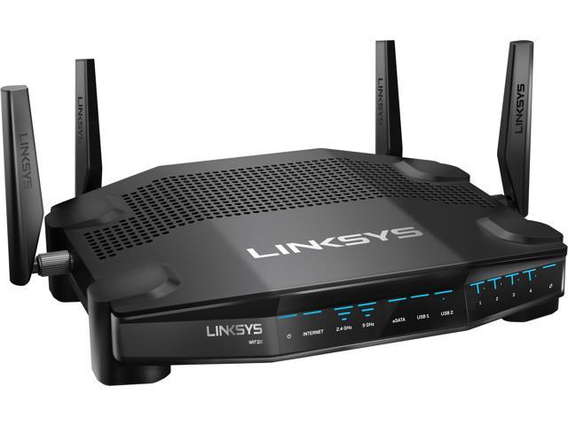
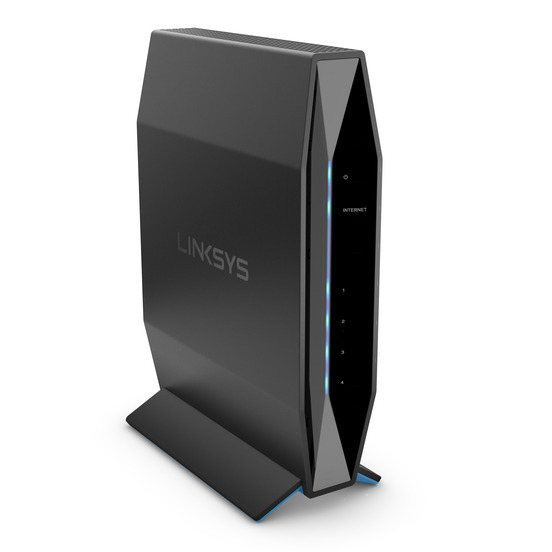

#  firmware autobuilder 

Original from [P3TERX](https://github.com/P3TERX/Actions-OpenWrt)  
Further modded  by [Eliminater74](https://github.com/DevOpenWRT-Router/Action_OpenWRT_AutoBuild_Linksys_Devices)

#### Made to simplify the firmware compilation thanks to the GitHub actions.
##### Ready to build firmware for Linksys wrt32x & e8450 (aka. Belkin rt3200)
<p align="middle">
  
  
</p>

Linksys **wrt32x**:

```
Target System: "Marvell EBU Armada"
Subtarget: "Marvell Armada 37x / 37x / XP"
Target Profile: "Linksys Venom (Linksys WRT32X)" and "Linksys WRT32X"
```

Linksys **e8450** (*This is a Universal Base Image (UBI) build and not the "standard" build*):

```
Target System: "MediaTek Ralink ARM"
Subtarget: "MT7622"
Target Profile: "Belkin RT3200 UBI" and "Linksys E8450 UBI"
```

> Snapshot changelog: https://git.openwrt.org/?p=openwrt/openwrt.git;a=shortlog

## Features:
Only for wrt32x:
- Patches taken from: [Divested-WRT](https://divested.dev/unofficial-openwrt-builds/mvebu-linksys/patches/)
- mwlwifi driver taken from: [Lean's OpenWRT](https://github.com/coolsnowwolf/lede/tree/master/package/kernel/mwlwifi)
- The DFS channels don't work, despite leaving the region code as it comes by default... So BT was removed (*kmod-mwifiex-sdio, mwifiex-sdio-firmware, kmod- bluetooth, kmod-btmrvl, kmod-mmc*) to see if this way the DFS channels work

Common:
- **NetData SQM char** from: https://github.com/Fail-Safe/netdata-chart-sqm ([how to set up](https://github.com/ferboiar/wrt32x/wiki/Build-configuration-tips#netdata-sqm-char "how to set up")) 
- **OpenWRTScripts** from: https://github.com/richb-hanover/OpenWrtScripts
- **autoSQM script** from: https://github.com/baguswahyu/autoSQM-damasus.bagus ([how to set up](https://github.com/ferboiar/wrt32x/wiki/Build-configuration-tips#autosqm_script "how to set up"))
- More scripts :
  - /usr/local/bin/opkg_list_installed.sh: list the user installed packages (https://gist.github.com/benok/10eec2efbe09070150ed2100d29dc743)
- **Network interfaces ports status** from: https://github.com/tano-systems/luci-app-tn-netports ([how to set up](https://github.com/ferboiar/wrt32x/wiki/Build-configuration-tips#network_port_status "how to set up")) 
- Especific '**Cryptographic Hardware Accelerators**' set up (https://openwrt.org/docs/techref/hardware/cryptographic.hardware.accelerators). Some more detail [here](https://github.com/ferboiar/wrt32x/wiki/Cryptographic-Hardware-Accelerators "here").
- **Wireguard** (*wireguard-tools, luci-proto-wireguard, luci-app-wireguard, kmod-wireguard*)
- **OpenVPN** server/client (*openvpn-openssl, openvpn-easy-rsa, luci-app-openvpn, kmod-tun*)
- **USB Storage** (*kmod-usb-storage, kmod-usb-storage-extras, kmod-usb-storage-uas, kmod-usb-ohci, kmod-usb-uhci, kmod-usb2, kmod-usb3, kmod-fs-ext4, kmod-fs-vfat, kmod-fs-ntfs, kmod-scsi-core, kmod-nls-cp437, kmod-nls-iso8859-1, block-mount, block-hotplug, e2fsprogs, usbutils, usbids, ntfs-3g*)
- **NetData** (*netdata, bash, coreutils-timeout, curl*). Access through http://router_ip:19999. luci-app-netdata doesn't work with firefox at least
- **Atheros 9k WIFI driver** (*ath9k-htc-firmware, kmod-ath, kmod-ath9k-common, kmod-ath9k-htc*)
- **Themes**: [Argon](https://github.com/jerrykuku/luci-theme-argon "Argon"), Bootstrap (dark & light), [Edge](https://github.com/kiddin9/luci-theme-edge "Edge"), [Material](https://github.com/LuttyYang/luci-theme-material "Material") and OpenWrt2020
- adblock, banip, dynamic dns, file explorer, wifi schedule, watchcat, wake on lan, bandwith monitor, samba 4, upnp, vpn bypass, vpn policy routing, ocmproxy...

## Releases:
A compilation for each router will be published monthly on https://github.com/ferboiar/wrt32x/releases.  
If your router already has Openwrt firmware, simply download one of these files:  
- for **wrt32x**: download the file `sysupgrade.bin`
- for **e8450/rt3200**: download the file `sysupgrade.itb`

If your a8450/rt3200 router does not come with openwrt and you want to convert it to UBI you must follow these instructions before uploading the firmware from this site: https://github.com/dangowrt/owrt-ubi-installer
_______________________________________________________________________
 

  
  


### Actions Status
[](https://badges.pufler.dev)  
[](https://github.com/ferboiar/wrt32x/actions/workflows/cleanup.yml)  
[](https://github.com/ferboiar/wrt32x/actions/workflows/build-wrt32x.yml)  
[](https://github.com/ferboiar/wrt32x/actions/workflows/build-e8450.yml)  

### Repo Updated:
[](https://badges.pufler.dev) 


_______________________________________________________________________


[](https://github.com/ferboiar/wrt32x/blob/master/LICENSE)  
